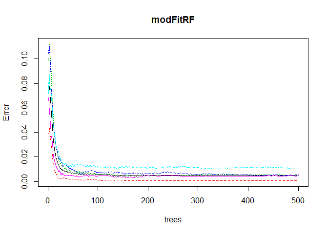
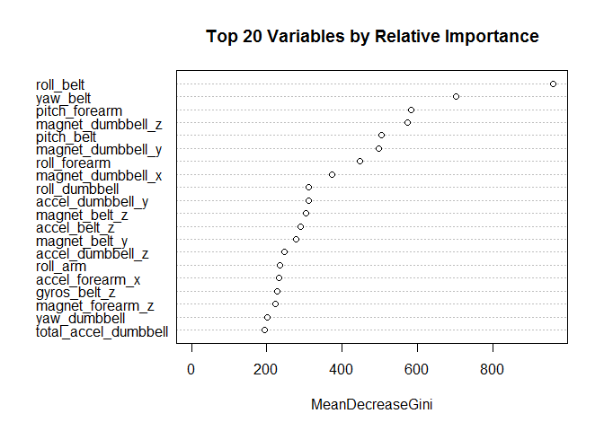
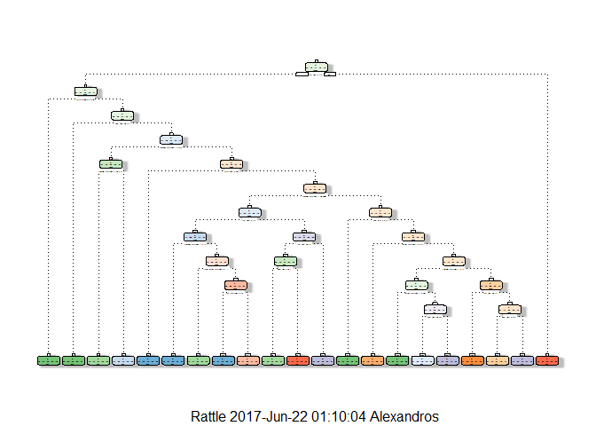

    library(caret); library(rpart); library(rpart.plot); library(e1071); library(randomForest);
    library(RColorBrewer); library(rattle); library(gbm)

    set.seed(12345)

Summary
-------

We perform a human activity recognition analysis. Based on
accelerometers attached to subjects we train a model to predict whether
or not the subject had performed correctly a weight lifting exercise.
The model that we use is the random forest with an accuracy of 99.6%.

Getting and Cleaning The Data
-----------------------------

We download the training and test data from the given Url's and read
them.

    setwd("D:/Data Science/Coursera/Practical Machine Learning/Final")

    if(!file.exists("./data")){
      dir.create("./data")
    }

    TrfileUrl <- "http://d396qusza40orc.cloudfront.net/predmachlearn/pml-training.csv"

    TefileUrl <- "http://d396qusza40orc.cloudfront.net/predmachlearn/pml-testing.csv"

    download.file(TrfileUrl, destfile = "./data/Trdata.csv")

    Trdat = read.csv("./data/Trdata.csv", na.strings = c("NA", "#DIV/0!", ""))

    download.file(TefileUrl, destfile = "./data/Tedata.csv")

    Tedat = read.csv("./data/Tedata.csv")

First let's do some exploratory analysis.

    dim(Tedat); dim(Trdat)

    ## [1]  20 160

    ## [1] 19622   160

We observe that the test set is very small compared to the training set,
and this may cause some unreliability to the evaluation of our analysis.
The data set has also many variables. In addition we observe that the
Training data set almost 60% consists of NA's

    sum(is.na(Trdat))/(dim(Trdat)[1]*dim(Trdat)[2])

    ## [1] 0.6131835

Hence, a first step is to remove the columns with more than 90% of NA's.

    TrainDat <- Trdat[ , colSums(is.na(Trdat))/dim(Trdat)[1]<0.9]

The train set now is free of NA's and the variables reduced to 60.

    ncol(TrainDat)

    ## [1] 60

We also subset the test set

    TestDat <- Tedat[ , colSums(is.na(Trdat))/dim(Trdat)[1]<0.9]

We now split the main training data set to the training and test set.
Then we will use our prediction model to predict the values for the
classe variable, given in the initial test set. In addition columns 1 to
7 does contain only descriptive data that are not related to the motion
of the subject. This predictors are not related to the response and they
will increase variance without a corresponding decrease in bias.

    inTrain <- createDataPartition(TrainDat$classe, p = 3/4)[[1]]

    training <- TrainDat[inTrain, ][ ,-c(1:7)]

    testing <- TrainDat[-inTrain, ][ ,-c(1:7)]

Fitting models
--------------

First we do a random forest fit

    modFitRF <- randomForest(classe ~ ., data=training)

    predRF <- predict(modFitRF, testing, type = "class")

    CFRF <- confusionMatrix(testing$classe, predRF)

    CFRF$overall[1]

    ##  Accuracy 
    ## 0.9942904

    plot(modFitRF)

 The
accuracy of this method is 99.6%. Also, the error rate is less than 0.02
for all classe. We can also inspect the relative importance of the
variables for our method.

    varImpPlot(modFitRF, n.var = 20, main = "Top 20 Variables by Relative Importance")

Also, we fit a decision tree model

    modFitTR <- rpart(classe ~ ., data=training, method="class")
    fancyRpartPlot(modFitTR)

    predTR <- predict(modFitTR, testing, type = "class")
    CFTR<- confusionMatrix(predTR, testing$classe)
    CFTR$overall[1]

    ##  Accuracy 
    ## 0.7228793

The accuracy of this method is 76.3% and it is lower than the random
forest method.

From the above methods the Random Forest is the most efficient with 0.4%
chance to predict the classe wrong. Hence the accelerometers accurately
measure the form of the athlete to evaluate the correct form of this
particular weight lifting exercise.

For the given test set we get

    predFin <- predict(modFitRF, TestDat)
    predFin

    ##  1  2  3  4  5  6  7  8  9 10 11 12 13 14 15 16 17 18 19 20 
    ##  B  A  B  A  A  E  D  B  A  A  B  C  B  A  E  E  A  B  B  B 
    ## Levels: A B C D E
